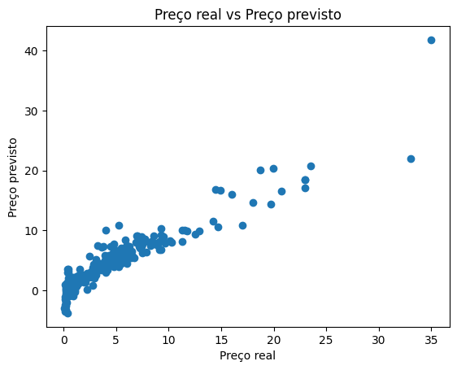
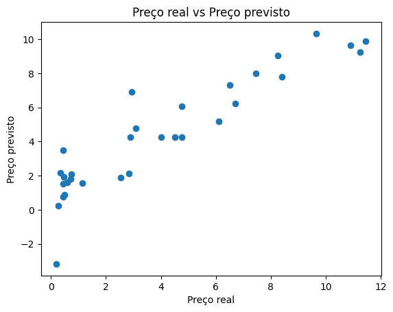
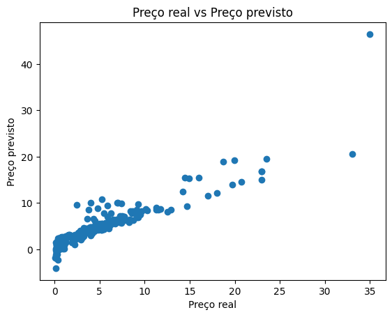
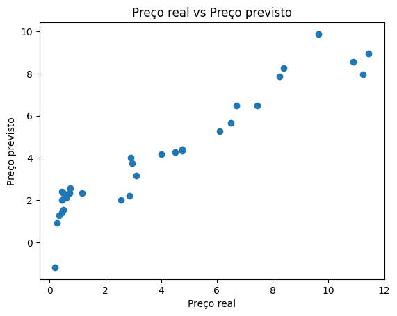

# Car Price Prediction
Projeto envolvendo conceitos de Machine Learning para predição de preços de carros usados.

## Work Flow

## Sobre o projeto

Este projeto foi feito para iniciar meus estudos na área de Machine Learning. Para realizá-lo, me baseei em um vídeo do YouTube e nos meus estudos de estatística e lógica de programação. Os dados importados provém de um site indiano, o que faz com que a moeda utilizada seja a Rupia Indiana.

## Regressão Linear e de Lasso

A regressão linear foi usada no projeto porque permite modelar a relação entre o preço (variável dependente) e fatores como idade do carro, quilometragem, marca, entre outros (variáveis independentes). A técnica ajuda a identificar padrões e estimar o valor do carro com base em características observáveis. Sendo uma abordagem simples e interpretável, é útil para entender como diferentes variáveis influenciam o preço e prever valores futuros com base em dados históricos.

A regressão Lasso foi usada no projeto para melhorar a precisão do modelo e lidar com conjuntos de dados com muitas variáveis. O Lasso (Least Absolute Shrinkage and Selection Operator) adiciona uma penalidade aos coeficientes das variáveis menos importantes, forçando alguns deles a zero, o que efetivamente realiza uma seleção de atributos. Isso é útil para simplificar o modelo, reduzir o risco de overfitting e aumentar a interpretabilidade, ao focar nas características mais relevantes que influenciam o preço do carro.

## Gráficos e resultados obtidos
<h4>Gráficos - Regressão Linear</h4>

  
  

Nesses gráficos, já é notável que a distância entre os pontos é pequena, mas que tende a aumentar conforme os preços vão ficando mais altos.

<h4>Gráficos - Regressão de Lasso</h4>

  
  

Agora, utilizando a Regressão de Lasso, é nítida a mudança na distância entre os pontos. Os resultados de predição obtidos pelo modelo se assemelham mais ainda aos preços reais.

## Tecnologias utilizadas

